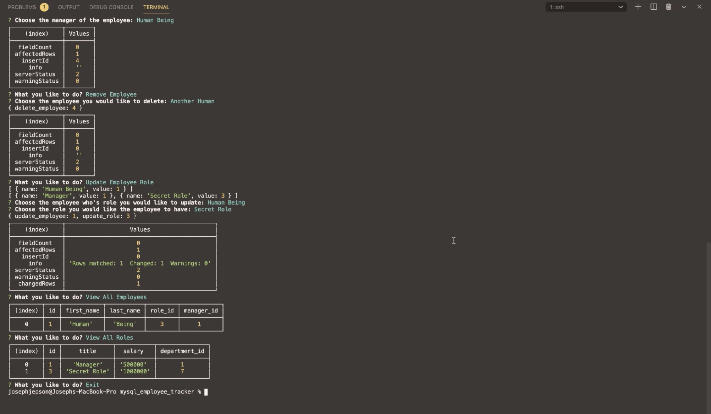

# 💡 Project Title: mysql_employee_tracker

## 🕹 Demo:

Video of demo: [mysql_employee_tracker_DEMO](https://drive.google.com/file/d/1A7vlyTgxvLf7moCUhghVpJKEeEMBKIyD/view) 

 
## 👤 Author: Joseph Jepson 

  ## 📜 Table of Contents: 

  * [Description](#Description) 

  * [Installation](#Installation) 

  * [Usage](#Usage) 

  * [Contributors](#Contributors) 

  * [Testing](#Testing)

  * [Contact](#Contact) 

  * [License](#License) 

  ## Description: 
CLI application that allows users to manage their business. Users can view/add/remove departments, view/add/remove/update roles, view/add/remove employees. 

## Installation: 
 Clone the repo, and run 'npm init', 'npm install mysql2'. Copy the 'employeeSchemma' text into a mysql workbench file, execute the script.  

## Usage: 
 Run 'node index.js' to start application. In order to use this application the user will need to use the schema and seeds to get starting data into the database. Then in order to follow the application's logic, add a new department FIRST > THEN a add role > THEN add an employee. User can't add an employee without a role or manager for the employee. User can't add a role without a department for the role. REMOVING a role will remove the employee attached to that role. REMOVING a department will remove all data/employees/roles contained within.

## Contributors: 
 Make a pull request to share helpful functions that you'd think would improve the project! 

## Testing: 

  ## Contact: 
 
  * 💌  Email: joey@joeyjepson.com 
 
  * 👤  GitHub Username: [alligatormonday](https://github.com/alligatormonday) 

  ## License: 
 
  
    MIT License

Copyright (c) 2020 Joseph Jepson

Permission is hereby granted, free of charge, to any person obtaining a copy
of this software and associated documentation files (the "Software"), to deal
in the Software without restriction, including without limitation the rights
to use, copy, modify, merge, publish, distribute, sublicense, and/or sell
copies of the Software, and to permit persons to whom the Software is
furnished to do so, subject to the following conditions:

The above copyright notice and this permission notice shall be included in all
copies or substantial portions of the Software.

THE SOFTWARE IS PROVIDED "AS IS", WITHOUT WARRANTY OF ANY KIND, EXPRESS OR
IMPLIED, INCLUDING BUT NOT LIMITED TO THE WARRANTIES OF MERCHANTABILITY,
FITNESS FOR A PARTICULAR PURPOSE AND NONINFRINGEMENT. IN NO EVENT SHALL THE
AUTHORS OR COPYRIGHT HOLDERS BE LIABLE FOR ANY CLAIM, DAMAGES OR OTHER
LIABILITY, WHETHER IN AN ACTION OF CONTRACT, TORT OR OTHERWISE, ARISING FROM,
OUT OF OR IN CONNECTION WITH THE SOFTWARE OR THE USE OR OTHER DEALINGS IN THE
SOFTWARE.
